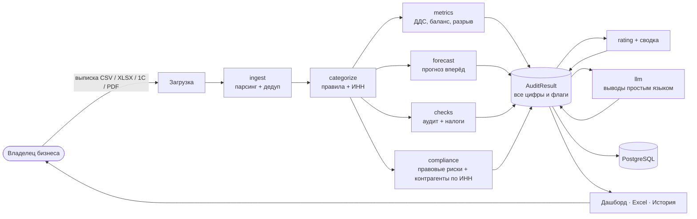

# FinAudit

**AI-аудитор финансов для малого бизнеса без штатного финансиста.**
Загрузи банковскую выписку — получи понятную картину: где кассовый разрыв, какие налоговые
и правовые риски, что с контрагентами, и что конкретно делать.

### 🔗 Живое демо: **[finaudit.site](https://finaudit.site)**

Можно зарегистрироваться и прогнать свою выписку (CSV / Excel / выгрузка в 1С). Версия сборки — `GET /version`.

---

Владелец загружает выписку → система структурирует данные, **считает все метрики кодом**
и через LLM объясняет результат человеческим языком: структура расходов, денежный поток,
**прогноз кассового разрыва вперёд**, налоговые и правовые риски, проверка контрагентов, рекомендации.

**Принцип (наш моат):** все цифры и все риск-флаги считает **детерминированный код** — точно,
воспроизводимо, «сходится с 1С». LLM (DeepSeek) только переводит готовый результат на понятный
язык и ничего не выдумывает. Мы не «обёртка над GPT».

## Ключевые возможности

**Приём данных**
- CSV, XLSX, **выгрузка в 1С** (1CClientBankExchange), текстовый PDF; детект кодировки CP1251/CP866, дедупликация.
- Маппинг колонок под реальные банки: Тинькофф Бизнес, СберБизнес, Альфа, ПСБ.

**Аналитика (всё детерминированно)**
- Структура расходов, ДДС по месяцам, дневная линия баланса, **кассовый разрыв с причиной**, алерты.
- **Прогноз вперёд:** детект регулярных платежей + учёт планируемых выплат → проекция баланса на 30–60 дней.
- Исключение внутренних переводов/займов из выручки, учёт сторно/возвратов.
- **Налоговый модуль:** резерв УСН 6%/15%, порог НДС для УСН (2026).
- **Учёт формы бизнеса:** при регистрации выбирается ИП / ООО / самозанятый и режим (УСН / НПД / ОСНО) — аудит подстраивается: для НПД показываем лимит 2,4 млн ₽ и ставки 4%/6% вместо неактуальной УСН-специфики.
- **Правовые риски со ссылками на реальные статьи** (НДС/УСН, 115-ФЗ, ст. 54.1 НК) — не угадайка ИИ.
- **Проверка контрагентов по ИНН** (ЕГРЮЛ/ЕГРИП через DaData): ликвидация, банкротство, дисквалификация, недавняя регистрация. Требует `DADATA_API_KEY`; без него аудит работает без этого блока.
- **Рейтинг финансового здоровья** (0–100 / A–E), **сводка для руководства** (светофор + вердикт).
- **Песочница «что если»:** структурное действие → код пересчитывает разрыв/баланс → было/стало.

**Работа с данными**
- Ручное исправление операций с детерминированным пересчётом всего анализа.
- Планируемые платежи → платёжный календарь → учёт в прогнозе.
- База документов, пакетный анализ (группировка по счёту, свод с дедупом), история, экспорт в Excel.

**Продукт и инфраструктура**
- Личный кабинет: регистрация/вход (bcrypt, **персистентные сессии в Postgres**), профиль, настройки.
- Мульти-провайдер ИИ: ключи пользователя (AES-GCM в БД), выбор модели, учёт токенов и стоимости.
- **Self-hosted:** свой сервер, своя БД, свой ключ ИИ — данные не покидают периметр ([SELF_HOSTED.md](SELF_HOSTED.md)).
- Деплой: Docker, Caddy (авто-TLS), healthcheck, авто-рестарт, **версионирование сборки** (`/version`), образ в GHCR.

## Стек

Go 1.25 (модульный монолит) · chi · pgx + PostgreSQL · DeepSeek API · DaData (ЕГРЮЛ/ЕГРИП) ·
Docker Compose · Caddy (авто-TLS) · goose (миграции)

> По хранилищу: метрики считает Go-код, PostgreSQL — надёжное хранилище операций/результатов
> (достаточно для объёмов одного бизнеса). ClickHouse заложен как задел под кросс-клиентскую
> аналитику на этапе масштабирования. Полная архитектура — `finaudit_architecture.md`, вектор — `VISION.md`.

## Архитектура

**Числа считает детерминированный код, LLM только объясняет** готовый результат:



## Пример анализа

**Вход:** квартальная выписка кафе на УСН (Q2 2026, ~70 операций).

**Что считает код:** доходы 1 154 000 ₽, расходы 1 297 000 ₽, чистый поток −143 000 ₽, остаток на конец 7 000 ₽,
рейтинг финансового здоровья D · 45/100.
**Кассовый разрыв 22.06.2026:** баланс уходит в −102 000 ₽ — совпали предоплата за кофемашину (180 000 ₽)
и налог УСН (130 000 ₽) до прихода денег от клиентов.
**Песочница «что если»:** перенос предоплаты на 7 дней → разрыв сокращается со 102 000 до 12 000 ₽.

**Что добавляет LLM (только текст):**
> «Операционный поток положительный (+37 000 ₽) — бизнес зарабатывает от основной деятельности. Разрыв
> 22 июня возник из-за крупной разовой инвестиции (кофемашина 180 000 ₽), совпавшей с уплатой налога,
> а не из-за операционки. Перенесите предоплату на 5–7 дней.»

## Как мы проверяли точность

Раз мы утверждаем, что числам можно доверять, — это надо доказывать. Есть **симуляционная сверка с эталоном**:
для трёх типовых бизнесов (ИП-розница УСН 6%, ООО-услуги УСН 15%, e-commerce с маркетплейсом) заранее посчитаны
эталонные годовые итоги. Тест прогоняет через весь конвейер по четыре квартальные выписки в разных форматах
(CSV / Excel / 1С) и сверяет результат с эталоном.

Все три сценария сходятся с эталоном **до копейки**, кассовый разрыв детектируется верно:

| Сценарий | Доход | Расход | Чистый поток |
|---|---|---|---|
| ИП-розница (УСН 6%) | 4 504 517 ₽ | 3 510 439 ₽ | 994 078 ₽ |
| ООО-услуги (УСН 15%) | 11 053 075 ₽ | 10 421 461 ₽ | 631 614 ₽ |
| E-commerce | 9 385 937 ₽ | 5 346 039 ₽ | 4 039 898 ₽ |

```bash
go test ./internal/simulate/ -run TestSimAnnualReconciliation -v
```

Это ровно то свойство, которого нельзя добиться, отдав подсчёт нейросети: результат **воспроизводим**.

## Посмотреть вживую

Сервис задеплоен и открыт: **[finaudit.site](https://finaudit.site)** — можно зарегистрироваться и загрузить свою выписку.

Разбор продукта со скриншотами интерфейса и реальными цифрами — в статье:
**[Мы сделали ИИ-аудитора финансов для малого бизнеса — и принципиально не дали нейросети считать деньги](https://vc.ru/dev/3021902-ii-auditor-finaudit-dlya-malogo-biznesa)**.

## Структура

```
cmd/server           — точка входа (main.go), эндпоинты /health, /version
internal/
  config             — конфиг из env
  api                — chi роутер, хендлеры (auth, settings, credentials, batches, documents, planned), middleware, сессии
  ingest             — парсинг CSV/XLSX/1С/PDF + маппинги банков + нормализация/дедуп
  categorize         — категоризация по правилам (ключевые слова + ИНН)
  metrics            — кассовый разрыв, ДДС, баланс, алерты, внутренние переводы, сторно
  forecast           — прогноз баланса вперёд (регулярные + планируемые платежи)
  checks             — аудиторский чек-лист + налоговый модуль (УСН/НДС)
  compliance         — правовые риски со статьями (lex-база) + comp2 по контрагентам
  counterparty       — проверка контрагентов по ИНН (DaData ЕГРЮЛ/ЕГРИП)
  rating             — рейтинг финансового здоровья (0–100 / A–E)
  simulate           — песочница «что если»
  reconcile          — сверка выписка × документы (роадмап)
  llm                — клиент LLM: выводы, провайдеры, стоимость, баланс
  crypto             — AES-GCM шифрование ключей ИИ
  export             — выгрузка в Excel
  models             — доменные типы (AuditResult, Forecast, ComplianceFlag, Rating…)
  storage/postgres   — pgx: users, uploads, transactions, audit_results, credentials, batches, documents, planned, sessions
db/migrations         — goose миграции (00001…00009)
deploy/               — docker-compose, Dockerfile, Caddyfile (+ self-hosted варианты)
web/                  — фронтенд кабинета (лендинг, вход, дашборд, история, база, пакет, настройки, политика)
```

## API (основное)

```
GET    /health · /version                 — статус · версия сборки
POST   /api/register | login | logout     — аутентификация;  GET /api/me
POST   /audit                             — выписка → аудит;  POST /export → Excel
GET    /api/uploads · /{id}               — история · результат
GET    /api/uploads/{id}/export           — Excel по сохранённому анализу
POST   /api/uploads/{id}/edit             — правка операций + пересчёт
POST   /api/uploads/{id}/simulate         — песочница «что если»
GET/POST/DELETE /api/planned              — планируемые платежи (платёжный календарь)
GET/POST/DELETE /api/ai/credentials       — ключи ИИ пользователя (+ активация, баланс)
POST   /api/batches · /api/documents      — пакетный анализ · база документов
```

## Быстрый старт (локально)

```bash
cp .env.example .env      # DEEPSEEK_API_KEY + APP_ENC_KEY (openssl rand -base64 32); опц. DADATA_API_KEY
make up                   # Postgres + app + Caddy
make migrate              # миграции 00001…00009 (goose)
```

Развёртывание на своём сервере — см. **[SELF_HOSTED.md](SELF_HOSTED.md)**. Лицензия — [LICENSE.md](LICENSE.md).

## Приватность

Финансовые расчёты выполняет код на нашей стороне; в модель ИИ уходят только агрегаты, а не сырые
выписки. Ключи и пароли — в зашифрованном виде. В self-hosted-режиме данные не покидают ваш периметр.
Подробнее — [политика конфиденциальности](web/privacy.html).
