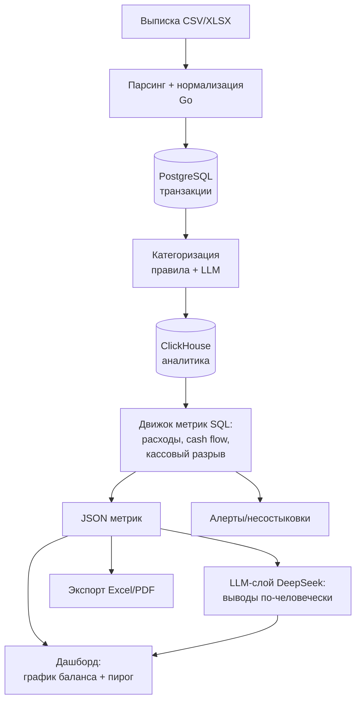

# FinAudit — AI-сервис финансового аудита для малого и среднего бизнеса

> Рабочий документ команды. Стек, архитектура и план спринтов на хакатон + прод-роадмап.
> Версия от 23.06.2026.

---

## 1. Концепция

Владелец бизнеса загружает финансовые данные (на старте — банковская выписка), система автоматически структурирует их, считает метрики кодом, а LLM переводит результат на человеческий язык без бухгалтерского жаргона: структура расходов, денежный поток, **риск кассового разрыва**, прозрачность потоков и выводы с рекомендациями.

**Главный принцип архитектуры:** цифры считает код (детерминированно), LLM только объясняет посчитанное. Никаких финансовых решений на модели — это убирает галлюцинации и делает результат предсказуемым.

**Киллер-фича для демо:** прогноз кассового разрыва. Считается алгоритмически, продаётся жюри за 5 секунд («14 августа у тебя минус 200к — мы предупредили за месяц»).

---

## 2. Финальный стек

Единый язык — **всё на Go** (монолит). Один язык = минимум интеграционных швов, что критично при вайбкодинге. Плюс Go — карьерный стек, проект идёт в портфолио.

### Ядро (ставим сразу, это и есть MVP)

| Слой | Технология | Зачем |
|---|---|---|
| Язык | **Go 1.22+** | Единый стек, карьерная ценность |
| HTTP / роутер | `net/http` + **chi** | Чище gin, лёгкий |
| Парсинг файлов | **excelize** (XLSX), stdlib `encoding/csv` | Чтение выписок |
| Основное хранилище | **PostgreSQL** через **pgx + sqlc** | Типобезопасные запросы из SQL, без тяжёлого ORM, прод-грейд |
| Миграции | **goose** или **golang-migrate** | Версионирование схемы |
| Аналитика | **ClickHouse** (`clickhouse-go`) | Агрегаты, cash flow, прогноз баланса — SQL-запросами (зона дата-инженера) |
| LLM | **DeepSeek `deepseek-v4-flash`** через HTTP API | Категоризация + текстовые выводы |
| Логи | **`slog`** (stdlib), JSON в stdout | Структурные логи с первого коммита |
| Контейнеризация | **Docker + Docker Compose** | Весь стек одной командой |
| Конфиг | env-переменные (на проде — `viper`) | Секреты не коммитим |
| Фронтенд | **React + Recharts** | Быстрая красивая демка (альтернатива — Go + templ + htmx) |
| Reverse-proxy | **Caddy** | Авто-HTTPS для демо |

### Прод-роадмап (навешиваем поверх работающего MVP, если есть время / для резюме)

| Технология | Зачем именно нам |
|---|---|
| **RabbitMQ** | **Главный архитектурный апгрейд.** Обработка выписки + вызовы LLM медленные (секунды) → в проде задача уходит в очередь, юзеру сразу «принято», воркер молотит асинхронно. Естественный паттерн под нашу нагрузку |
| **Redis** | Кэш посчитанных аудитов (не пересчитывать при каждом открытии дашборда), rate limiting на загрузки, статус фоновых задач |
| **OpenAPI / Swagger** | Документация REST, прод-сигнал |
| **Prometheus + Grafana** | Метрики latency p95, длина очереди, кэш-хиты. Красивый слайд «наблюдаемость из коробки» |
| **GitHub Actions** | CI: lint / test / build образов |
| **k6** | Нагрузочное тестирование, артефакт для резюме (post-MVP) |

### Выкинуто (cargo cult из чужих проектов — не тащим)

- **gRPC** — у нас монолит, нет межсервисного взаимодействия. Смысл появится только если позже вынесем OCR-воркер, и то проще REST.
- **Kafka** — для высокочастотных event-стримов, у нас такого нет. Заменяется RabbitMQ.
- **Elasticsearch / OpenSearch** — нет корпуса текстов для full-text поиска. Если понадобится поиск по транзакциям — хватит full-text в Postgres.

---

## 3. Архитектура: от входа до выхода

### ВХОД

Банковская выписка в **CSV / XLSX** (на старте — 1-2 конкретных формата, напр. выгрузка Тинькофф/Сбер; можно сгенерировать тестовую самим). PDF, Word, сканы, 1С — «в перспективе», на слайде, не в коде.

Сырая строка: `дата · сумма · тип операции · контрагент · ИНН · назначение платежа`.

### ОБРАБОТКА

**Шаг 1 — Парсинг → нормализация (Go).**
Читаем файл, приводим каждую строку к единой схеме транзакции, пишем в Postgres. Чистый код, без ИИ. Это «структуризация» — первый работающий скелет.

```
transactions:
  id, upload_id, date, amount (decimal),
  direction (in/out), counterparty, inn,
  purpose (raw text), category (nullable)
```

**Шаг 2 — Категоризация (правила + LLM).**
Сначала правила по ключевым словам в назначении и по ИНН (аренда, зарплата, налоги, эквайринг, закупка) — ловят ~80%. Остаток батчом уходит в LLM, результат пишется в `category`.

**Шаг 3 — Движок метрик (детерминированно, SQL в ClickHouse).**
- Структура расходов — сумма по категориям за период → пирог
- Денежный поток — приход/расход по неделям/месяцам → график
- **Кассовый разрыв** — проекция баланса вперёд по датам ожидаемых платежей и поступлений; находим день, где баланс уходит в минус
- Бонус-алерт — несостыковки (дебет/кредит не бьётся, дубли)

Выход слоя — **структурированный JSON с цифрами**, не текст.

**Шаг 4 — LLM-слой объяснений (DeepSeek).**
На вход модели — **только посчитанный JSON** (не сырые транзакции: дешевле и безопаснее). На выход — текст без жаргона + рекомендации.

### ВЫХОД

- **Дашборд** (главное для демо): график баланса с красной зоной кассового разрыва + пирог расходов + блок текстовых выводов
- **Экспорт** в Excel / PDF — обратная выгрузка из БД
- **Алерты** — список найденных рисков и несостыковок

### Схема потока данных



---

## 4. Спринты

Роли: **Т** — ты (продукт, фронт, промпты, питч) · **ДИ** — дата-инженер (данные, SQL, метрики) · **СА** — сисадмин (инфра, деплой, API-обвязка).

### Хакатон (MVP)

**Спринт 0 — Каркас** *(все, 1-2 ч)*
Репозиторий, Docker Compose (Postgres + ClickHouse + Go-сервис), схема таблиц, тестовая выписка, контракт JSON между слоями. Без этого ночью утонете в интеграции.

**Спринт 1 — Ingestion** *(ДИ + Т)*
Парсер CSV/XLSX → нормализация → запись в Postgres.
*Цель: загрузил файл — видишь строки в БД.* Это работающий скелет.

**Спринт 2 — Движок метрик** *(ДИ, SQL/ClickHouse)*
Структура расходов, cash flow, прогноз баланса → кассовый разрыв. Выдаёт JSON. Категоризация пока правилами, без LLM.
*Приоритет №1 после ingestion — это ядро ценности.*

**Спринт 3 — LLM-слой** *(Т + СА)*
DeepSeek API: категоризация непонятных транзакций + генерация выводов из JSON. Промпты — зона Т.

**Спринт 4 — Дашборд** *(Т)*
График баланса с красной зоной, пирог расходов, блок выводов, кнопка загрузки. Лицо демки — вложиться.

**Спринт 5 — Экспорт + инфра** *(СА)*
Выгрузка в Excel/PDF, деплой на VPS, Caddy/HTTPS, env/секреты, прогон демо end-to-end.

**Спринт 6 — Питч** *(все, последний час)*
Сценарий: «выписка владельца кафе → загрузили → структура расходов → кассовый разрыв 14 августа, предупредили за месяц». Один чёткий нарратив.

### Прод-роадмап (после MVP / для развития проекта)

**Спринт 7 — Асинхронность.** RabbitMQ: загрузка → очередь → воркер. HTTP больше не висит на время обработки.

**Спринт 8 — Кэш и лимиты.** Redis: кэш аудитов, rate limiting, статусы задач.

**Спринт 9 — Наблюдаемость.** Prometheus + Grafana: latency p95, длина очереди, кэш-хиты.

**Спринт 10 — Зрелость.** OpenAPI-доки, GitHub Actions CI (lint/test/build), k6 нагрузочное, object storage под документы, бэкапы, аутентификация и изоляция данных клиентов.

**Спринт 11 — Расширение входа.** OCR для сканов/PDF (отдельный воркер, единственное оправданное место под Python), затем поддержка большего числа форматов банков.

### Опциональный бонус — MCP-слой «поговори со своими финансами»

**Статус: опционально, только поверх готового ядра.** Делаем, ТОЛЬКО если уже работает связка ingestion → метрики → дашборд. Если ядро не готово — не трогаем, обёртывать нечего.

**Что это:** тонкий MCP-сервер на Go, который отдаёт уже посчитанные метрики как инструменты для любого MCP-клиента (Claude и т.д.). Внутри — переиспользование тех же запросов к Postgres/ClickHouse, нового кода минимум.

**Инструменты:** `get_cash_gap`, `get_expense_breakdown`, `list_alerts`, `query_transactions`.

**Зачем:** превращает статичный дашборд в разговорный интерфейс к финансам («какой у меня риск кассового разрыва в августе?», «сколько ушло на поставщиков в мае?»). Реальная фича, а не украшение; MCP в тренде у жюри; «написал MCP-сервер на Go» — конкретный навык для резюме.

**Чего НЕ делать:** не пихать MCP в парсинг/подсчёт метрик — там он не нужен (LLM работает одноразовым трансформером, не агентом). MCP оправдан только как слой запросов поверх готовых данных. Уровень Спринта 7+, не ночь хакатона.

---

## 5. Правило приоритета (если горит время)

```
ingestion → метрики (кассовый разрыв) → дашборд
```

Это минимальный работающий продукт. Категоризация через LLM, экспорт, алерты, RabbitMQ/Redis/Prometheus — режутся первыми. **Сначала синхронный рабочий конвейер, прод-инфра навешивается поверх работающего ядра.** Не утонуть в инфраструктуре вместо продукта.

---

## 6. Стоимость токенов

DeepSeek `deepseek-v4-flash`: **$0.14 / 1M входных** токенов, **$0.28 / 1M выходных**.

> ⚠️ Алиас `deepseek-chat` отключают 24.07.2026 — указываем `deepseek-v4-flash` напрямую.

На один полный аудит: ~7k входных + ~1.5k выходных токенов ≈ **$0.0014** (десятая часть цента). Так дёшево, потому что в модель идут **агрегаты, а не сырые транзакции**.

Хакатон: 1000 аудитов ≈ $1.4. Кладём **$5** на баланс и забываем. Себестоимость аудита — доли цента (хороший пункт для питча).

---

## 7. Инфра (резюме)

GPU не нужен — вся «тяжесть» в DeepSeek API. Для хакатона: **один VPS** (2-4 vCPU, 4-8 ГБ RAM) + Docker Compose (Go + Postgres + ClickHouse + Caddy) + env-секреты + домен с авто-HTTPS. Дёшево масштабируется — плюс для питча.
